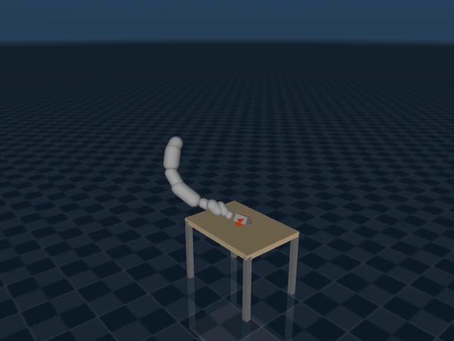

# Vega Grasping: Weekend Report

## What I built

I built a training pipeline for the Dexmate Vega humanoid that learns to grasp YCB objects with its right arm and hand in MuJoCo MJX. The single-object policy reliably makes contact with a randomized cube (the grasp metric peaks around 1.0), but it doesn't reliably lift and hold. A four-object extension is running at the time of writing.

Everything I'm describing here (code, MJCFs, YCB assets, checkpoints, videos) is in the repo.

---

## 1. The task

The setup is the Dexmate Vega: a 7-DoF right arm and an 11-DoF right hand, so 18 actuated joints in total. Four YCB objects to deal with (potted meat can, banana, mug, foam brick). Joint position control. Domain randomization over object XY, yaw, and table height. One policy across all objects.

Sparse-reward from-scratch RL isn't going to work here. The space of 18-joint configurations that happen to close around a 5-cm object in an 8×12 cm region within 250 steps of exploration is vanishingly small. That pushed most of the work into three places: (a) a robot model that's faithful enough, (b) a reward that makes credit assignment tractable, and (c) a training loop that actually survives MJX on a single A100.

---

## 2. Robot and scene

### 2.1 URDF → MJCF

`scripts/convert_urdf.py` turns the Dexmate URDF into an MJCF. A few things worth mentioning:

- I kept the full humanoid topology and just locked the left side (plus torso and head) with high stiffness and damping on `springref` joints. Deleting those links would have shifted the mass distribution around and I wasn't confident I could match the reach geometry afterwards.
- 18 position actuators on the right arm and hand.
- Palm site and 5 fingertip sites, used by the reward.
- **Collision geoms are MuJoCo `fitaabb`-fitted primitives, not the original meshes.** This was forced, not chosen. When I tried raw meshes (~1.1M vertices across the right arm and hand), MJX asked for a 420 GiB allocation inside `fwd_position`. On my setup, MJX-JAX seems to process mesh vertices per env per step, and dropping `num_envs` as low as 64 still OOM'd. The fitted primitives keep the URDF inertias (mass, CoM, diagonal inertia) while collapsing collision down to primitive-primitive pairs, which was the only way I could get this running.

**Validation renders (joints swept individually, and zero-control settle with locked left side):**

<video src="joint_test.mp4" controls width="640" title="Per-joint axis and limit sweep — 18 actuators"></video>

<video src="robot_view.mp4" controls width="640" title="Zero-control settle: locked left side, right arm at rest"></video>

*Fallbacks:* [joint_test.mp4](joint_test.mp4) · [robot_view.mp4](robot_view.mp4)

### 2.2 Scene

Floor at z=0, table at z=0.78, object sitting on the table. The scene XML templates out the object body, so `envs/ycb_objects.inject_into_scene()` can swap in whichever YCB object is needed at load time.



<video src="scene_verify.mp4" controls width="640" title="Full scene, robot in grasp-ready pose, 10 seconds"></video>

<video src="scene_verify_hand_closeup.mp4" controls width="640" title="Palm (red) and 5 fingertip sites (green) close-up"></video>

*Fallbacks:* [scene_verify.mp4](scene_verify.mp4) · [scene_verify_hand_closeup.mp4](scene_verify_hand_closeup.mp4)

### 2.3 YCB objects

| Object | Mass | Half-extents (m) | Collision |
|---|---|---|---|
| potted_meat_can | 0.368 | (0.051, 0.030, 0.042) | box |
| banana | 0.068 | (0.054, 0.089, 0.018) | capsule along Y |
| mug | 0.102 | (0.046, 0.046, 0.040) | box |
| foam_brick | 0.030 | (0.026, 0.039, 0.026) | box |

Same idea as the robot: the visual geom is the real textured mesh, the collision geom is a simple primitive.

Two choices in this table worth calling out.

**The mug is a box, not a cylinder.** The MJX docs list cylinder-vs-box (and cylinder-vs-mesh) collision as unsupported or only partially supported, so I went with a box to keep the mug-on-table contact reliable.

**The banana stays a capsule even though a box would probably train faster.** The whole point is to train one policy across varied shapes, and a capsule is the minimum primitive that captures the banana's elongation. Approximating it as a box felt like cheating.

There's a longer version of this argument in my design notes, but the short version is: raw meshes are too expensive for MJX at training scale, MJX's mesh collision support is version-dependent anyway (some pair combinations are listed as unsupported in the docs), and the reward I care about only looks at distances and contact, not micro-geometry. The visual mesh still shows up in rendering. A similar simplified-collision approach shows up in most dexterous RL pipelines I've looked at (MuJoCo Menagerie hands, for example, use primitive collision for the same throughput reason).

Trade-offs I'm accepting with this:
- The banana's curvature is gone from the collision model. A policy can't learn to pinch along the curve.
- The mug handle is gone. No handle-grasp strategy is going to come out of this.
- A policy trained on primitives is specific to simplified collision. Sim-to-real would plausibly need collision-parameter domain randomization, system ID, and probably residual fine-tuning on hardware.

---

## 3. Environment

`envs/vega_pick_ycb.py`, built on `mujoco_playground._src.mjx_env.MjxEnv`. With 256 parallel envs on one A100 I'm getting around 1200 tps in the single-object setup and around 665 tps in the multi-object one.

### 3.1 Observation

State-based, no vision. **101-D for single-object, 104-D for multi-object** (the multi-object env adds object half-extents and a 4-dim one-hot for which object is active, and drops a few redundant components to stay at 104). Composition:

- 18 arm+hand qpos, 18 qvel
- Palm position (3), 5 fingertip positions (15)
- Object pose: position (3) + quaternion (4), linear velocity (3), angular velocity (3)
- Palm-to-object vector (3), 5 tip-to-object vectors (15)
- Object half-extents (3)
- 5 per-finger touch sensor readings

### 3.2 Action

18-D, tanh-squashed Gaussian. Actions are deltas on the position targets, not absolute positions: `target ← clip(target + action * 0.05, qmin, qmax)`. Control step is 50 ms, physics step is 5 ms, so 10 physics substeps per control step.

### 3.3 Randomization

Per reset:
- Object X: ±4 cm
- Object Y: ±6 cm
- Object yaw: ±π
- Table height jitter: 0 – 4 cm (I had to fix this; my first attempt used -2 to +2 cm and spawned objects 18 mm below the table surface, which produced NaN contact impulses at step 0)
- Optional ±1° per-joint arm noise

The arm starts from a fixed "grasp-ready" pose, `[-1.107, -0.414, -1.071, -1.222, 0, 0, 0]`, that puts the hand above the table facing down. This is a fixed favorable initialization, which is a weaker version of DeepMimic-style RSI (which samples along a reference motion rather than always starting from one pose). The practical effect is the same: reaching is mostly taken off the critical path, so RL can spend its budget on grasp and lift.

### 3.4 Termination

An episode ends at 250 steps, or if the object drops below table - 5 cm (fallen), or if any NaN shows up in qpos. Reward is clipped to [-1e4, 1e4] as a safety net.

---

## 4. Reward

```
r = reach_scale    · reach
  + obj_touch_scale · tip_prox
  + grasp_scale    · grasp         # gated on palm preshape
  + lift_scale     · lift          # gated on grasp
  + success_scale  · success       # gated on sustained lift
  + smoothness
```

Gates:

| Threshold | Value | Role |
|---|---|---|
| palm-to-object | 10 cm | enables grasp reward |
| fingertip-to-object | 8 cm | enables touch reward |
| lift target | 5 cm | success height |
| fall | table − 5 cm | object fallen, terminate |

The idea is that gates stitch the long-horizon task into local gradients. Grasp needs palm near; lift needs grasp; success needs sustained lift. Without those gates, the policy finds modes where finger closing fires the grasp reward even though the palm is nowhere near the object.

The large terminal `success` bonus (scale in the 2 to 5 range) is where the real task signal actually lives. Everything before it is shaping to make that signal reachable.

### 4.1 Curriculum

The curriculum that actually ran in the reference config is 1D on height: 1 cm → 2 cm → 3 cm. I also tried a 2D version that graduates over (height, min-hold-frames) jointly. Graduation is Rapid-Locomotion style: rolling mean success > 0.02 over a 20-iter window.

Best 2D result I got: `floor9_te12_sparse_nrst_v1` made it to stage 2 (2 cm / 2 steps) with peak grasp 0.84 and peak success 0.086, then collapsed.

### 4.2 Reward hacking I watched happen

Rendering the best policies showed me that a high grasp reward doesn't mean real grasping. Two specific things were going on.

**`obj_touch` dominance.** With `obj_touch_scale = 2.0`, over the last 50 iters of `floor9` the reward breakdown averaged 50.3% `obj_touch`, 45.2% `grasp`, 1.4% `success`, and ~3% split across reach/lift/hold. The policy figured out that hovering fingertips near the object captures most of the reward budget cheaply, without ever actually grasping. Dropping `obj_touch_scale` to 0.5 rebalanced things but created a new problem; see §4.3.

**Grasp-by-brushing.** The original grasp reward fires at `touch > 0.01 N`. That's the weight of a 1-gram object sitting on the sensor, basically no force. Combined with the 8 cm fingertip gate, the policy learned that brushing the object lightly from arm's length is enough to accumulate grasp reward without closing the hand.

<video src="videos/floor9_best_stage2.mp4" controls width="640" title="floor9 peak at 2D curriculum stage 2 — visible obj_touch/grasp hacking"></video>

*Fallback:* [videos/floor9_best_stage2.mp4](videos/floor9_best_stage2.mp4)

### 4.3 Softgrasp variant

To kill both hacks without throwing out the reward chain, I rewrote grasp and lift as fully continuous signals:

```python
PROX_CAP = 0.08   # m
FORCE_CAP = 0.5   # N

near_score  = clip(1 - tip_dist / PROX_CAP,  0, 1)
force_score = clip(touch        / FORCE_CAP, 0, 1)

n_contact = sum(near_score * force_score)   # product, not boolean AND
r_grasp_contact = palm_gate * clip(n_contact / 2.0, 0, 0.5)

grasp_ok      = clip(r_grasp_contact / 0.25, 0, 1)
height_factor = clip(obj_height / 0.05, 0, 1)
time_factor   = clip(held_steps / 5.0,  0, 1)
r_lift = grasp_ok * height_factor * time_factor    # 3-way product
```

The important shifts: contact is `near × pressing`, multiplicatively, so brushing at arm's length stops paying. Lift is a three-way product, so farming any one factor in isolation (like `grasp_ok` without height) doesn't yield anything. Success stays binary, which keeps the goal signal clean.

Note on `grasp_ok`: it saturates at `r_grasp_contact = 0.25` (half of the max possible `r_grasp_contact = 0.5`). That's intentional — the lift reward shouldn't wait for a maximal grasp before firing, only a good-enough one. The 0.25 threshold corresponds to roughly two fingers making contact with force ≥ 0.5 N, which is a reasonable "holding" bar.

It's selectable at run time via `ENV_VARIANT=softgrasp`. There's also a `vega_pick_ycb_tight.py` that tightens the tip threshold from 8 cm to 3 cm as a discrete alternative, but empirically the fingers basically never clear 3 cm before grasp learning has started, so that variant kills exploration.

#### Reach-scale sweep on softgrasp

Continuous rewards are strictly smaller-magnitude than the binary ones, so the reach bootstrap has to be stronger to get the palm into the grasp region. I swept `reach_scale ∈ {0.3, 0.5, 1.0}` with everything else fixed:

| reach_scale | iter probed | mean reach reward | palm_preshape firing | grasp reward |
|---|---|---|---|---|
| 0.3 | ~300 | 0.12 | ~0% | ~0 |
| 0.5 | ~300 | 0.30 | 4–11% | 0.006 (first non-zero) |
| 1.0 | ~150 | 0.60 | ~0.2% | ~0 |

0.5 was the first value where palm preshape fired enough to see any grasp signal. 0.3 was too weak (the palm just sat ~20 cm away). 1.0 was interesting for the wrong reason: it over-rewarded being close, so the policy parked the palm at the object and never bothered closing fingers.

---

## 5. Training stack

### 5.1 Why SAC, not PPO

I started with PPO via Brax and MuJoCo Playground, matched to the PandaPickCubeCartesian defaults. Reach-only was fine. The full grasping task had a very specific and reproducible failure: reward climbed from around 17 to 116 over the first ~1.3M steps, then collapsed back to around 2 as the policy converged to an **arm-curl pose** (arm tucked back toward its gravity-balanced rest position).

What the logs showed was pretty clear. Once the policy settled at curl, `value_loss` dropped to ~0.003 (the value network was predicting the low-reward curl state almost perfectly), KL between policy updates fell to ~0.01, and policy_loss went to near zero. The whole thing locked up at a stable equilibrium that happened to have low reward, and from that point there was no gradient pointing anywhere.

My read on why curl is the attractor, offered as a diagnosis of this specific run rather than a general theorem: at the curled pose, gravity and the position servos balance, so small policy perturbations decay back to the same place. At the extended "near the object" pose the arm isn't in equilibrium, so small action noise amplifies instead of decaying. The policy sees high-variance returns in the extended region (physics noise makes the same action sometimes look great and sometimes bad) and low-variance returns at curl. PPO's advantage estimator ends up attributing that variance to "these actions are bad" and pushes away. This is at least consistent with the variance-shrinkage pathology that Hämäläinen et al. describe in the PPO-CMA paper ("PPO in continuous action spaces can prematurely shrink exploration variance… prone to getting stuck in local optima") and with the general warning in OpenAI Spinning Up that PPO policies become progressively less random and can get trapped. The specific "it ends in arm-curl in my env" mapping is my interpretation, though, not something those papers claim.

So I switched to **SAC** (`scripts/train_sac_vmap.py`). The replay buffer retains rare contact events, and the entropy term keeps exploration alive rather than collapsing. HER came next (`train_sac_her_vmap.py`) with a goal-conditioned env. HER seems to help when paired with a curriculum, but on its own it didn't bootstrap grasp discovery in this setup.

Worth flagging for context: Amazon FAR's ResFiT paper (Ankile et al., 2025, arXiv:2509.19301) uses the Dexmate Vega humanoid. Their setup has two 6-DoF hands and a 29-D action space, which is different from my right-arm-only, 18-D setup, so I'd call it the same Vega platform family rather than the same robot configuration. They explicitly chose BC-warmstart + off-policy residual RL over online PPO residual RL and report roughly a 200× sample-efficiency gain in simulation on BoxCleanup. So on this platform family, pure online RL from scratch is a known-hard problem. The BC-warmstart pathway was out of scope for a weekend without an existing demo pipeline, which is why SAC was the best tractable approximation I had.

### 5.2 SAC implementation notes

A few places where I diverged from `brax.training.agents.sac.train`:

- **Custom training loop.** Brax's SAC does one gradient step per env step and pays host↔device overhead each time. My loop batches 200 gradient updates inside a single `jax.lax.scan` that runs entirely on device. Most of the throughput I'm getting comes from that.
- **Vmapped rollouts.** 256 envs × 250 steps = 64K transitions collected in one JIT call.
- **Target entropy tuning.** Brax defaults to `target_entropy = -0.5 · action_dim = -9`, which gave slow alpha decay. I used -6 for single-object and -12 for HER. Note that this is summed across all 18 action dimensions, not per-dim. For an isotropic *pre-tanh* Gaussian, these entropies correspond to roughly σ ≈ 0.17, 0.12, and 0.09 per joint (post-tanh-squash entropy is strictly lower than the pre-tanh, so the effective per-joint exploration is smaller than these numbers suggest).
- **Alpha optimizer fix in the HER script.** Minor but worth recording: `train_sac_her_vmap.py` had a bug where `log_alpha` was initialized with the actor's optimizer instead of the alpha optimizer. Because `log_alpha` is a scalar the Adam moment shapes were still compatible, so nothing crashed, but alpha was being updated with the wrong LR and gradient-clip settings. Fixed. The main SAC script never had this bug.
- **CPU-side NumPy replay buffer.** 200K capacity. Sampled into (G, B, D) tensors and `device_put` once per iter, so the scan only ever sees device tensors.

Core hyperparameters:

```
n_envs                = 256
episode_length        = 250
batch_size            = 512
replay_capacity       = 200 000
min_replay_size       = 10 000 (single-obj) / 128 000 (multi-obj)
grad_updates_per_iter = 200
learning_rate         = 3e-4
lr_alpha              = 1e-4
discounting           = 0.99
tau                   = 0.005
reward_scaling        = 4.0
target_entropy        = -6.0
```

### 5.3 HER

Standard-ish. `her_k` future goals relabeled per real transition, where the goal is the object XY at some future step in the same episode. The curriculum graduates on height. There's also an optional alpha floor (`--alpha-floor 0.3`) and a per-stage alpha reset (`--alpha-stage-reset 0.7`) that I used to prevent entropy collapse during the early curriculum stages.

### 5.4 Numerical stability

Multi-object training kept NaN-ing in the first few iterations. The fix that worked was to prepend `optax.zero_nans()` to the optimizer chain and to sanitize policy actions on the rollout side before they reach physics. `optax.clip_by_global_norm` alone isn't a NaN firewall, because the global norm of a vector that contains any NaN is itself NaN, and dividing by NaN poisons every leaf.

```python
optimizer = optax.chain(
    optax.zero_nans(),
    optax.clip_by_global_norm(1.0),
    optax.adam(learning_rate),
)
```

On the rollout side: `acts = clip(where(isfinite(acts), acts, 0), -1, 1)` before every `env.step`.

---

## 6. Results

### 6.1 Reference single-object run: `smallbuf_lowreach_v1`

Plain SAC (no HER), sparse reward (reach + obj_touch + success), 200K replay buffer, fixed arm init, object XY and yaw randomized. 1132 iterations on a single A100.

| Metric | Peak | At iter |
|---|---|---|
| `grasp` | 1.006 | 729 |
| `success` | 0.016 | 378 |
| `reach` | saturated at 1.0 | ~50 |
| `alpha` | 1.0 → 0.12 | n/a |

**Rollouts from the best checkpoint, cube (4 episodes):**

<video src="checkpoints/smallbuf_lowreach_v1/videos/best_policy.mp4" controls width="640" title="Reference policy, cube, 4 episodes"></video>

**Same policy rendered on the banana (zero-shot, cube-trained):**

<video src="checkpoints/smallbuf_lowreach_v1/videos/best_policy_banana.mp4" controls width="640" title="Same policy on banana — same failure mode as on cube"></video>

*Fallbacks:* [best_policy.mp4](checkpoints/smallbuf_lowreach_v1/videos/best_policy.mp4) · [best_policy_banana.mp4](checkpoints/smallbuf_lowreach_v1/videos/best_policy_banana.mp4)

What this actually means:

- **Reach is solved** early, around iter 50–80.
- **Grasp discovery works.** The grasp metric reliably crosses 0.5 and peaks at ~1.0. The policy has learned to close the hand on the object once the palm is preshaped.
- **Lift doesn't bridge.** Episodes with `grasp = 1.0` often end with the object knocked off the table rather than lifted. In the best-policy rollout video (4 episodes), 3 ended off-table and 1 stayed roughly at table height.
- **Zero-shot on the banana** shows the same failure mode: the hand closes and displaces the object, but nothing lifts cleanly. Grasp strategy learned on a 5 cm cube doesn't automatically transfer to an 18 mm-thick capsule, as expected.

This is the real research gap and it lines up with what the dexterous-RL literature says in general: making contact is much easier than holding grip while lifting. Things I'd try next if I had more time:

- Tighten the grasp gating on the lift reward further
- HER relabeling of near-lifts
- A curriculum that scales object weight up gradually
- BC warmstart from scripted IK demos (the ResFiT path)
- A dedicated lift-only fine-tuning phase that starts from the grasp-capable policy

### 6.2 Multi-object (in progress)

All four YCB objects live in one MJX model. Per episode, one object is random-activated on the table and the other three are placed far off-table and physics-inert. The observation adds a 4-dim one-hot for which object is active, so the policy can condition on it.

v12 is the first version that trains past iter 5 without NaN-ing — the three-pronged fix (`optax.zero_nans()` in the optimizer chain, action sanitization in the rollout, and NaN-safe observation masking inside the loss functions) holds up.

**Update at iter 864 (final state before I killed the run):** alpha had collapsed to ~1.3 × 10⁻⁷. The cause is the `_safe_lp` clip at `(−100, 0)` that I added to stop `log_prob → +∞` from NaN-ing gradients — but clipping log_prob's upper bound at 0 makes the SAC alpha update compute `α · (−log_prob − target_entropy) = α · (0 − (−6)) = 6α` whenever log_prob is positive, which pushes α monotonically toward 0. Without entropy regularization, exploration dies. Peak grasp was 0.006 (effectively zero), peak success was 0.134 (a stray spike, probably from one env getting lucky early).

So multi-object training is now numerically stable, but the log_prob clip upper bound needs to be raised (e.g. `(−100, +30)`, which still protects against `+∞` but doesn't interfere with the normal α dynamics) for the next attempt.

### 6.3 Failure modes I'm not pursuing

Things I tried and learned from, not dead-ends to return to:

- **PPO arm-curl** (§5.1): drove the switch to SAC.
- **Alpha collapse**: `target_entropy = -4` crashed alpha to 0.04 by iter 100, which killed exploration before grasp discovery could happen. The v12 multi-object collapse (§6.2) is a different instance of the same failure mode, caused by an overly restrictive log_prob clip.
- **Q-mode escape**: with `reach = 0.05` and no alpha floor, the policy converged to "stay far from the object" because there was no contact penalty to push it back.
- **Reach exploitation**: with dense rewards and an alpha floor, the policy looped on easy reach reward without progressing to grasp.
- **Spike-and-drop grasp** (HER `k=8`, buffer 200K): a brief grasp signal followed by divergence. The replay buffer was cycling every ~0.35 iters, which made sampling effectively random.

Each of these fed back into the final reference config.

---

## 7. Deliverables

### Layout

```
robotic_grasp/
├── dexmate-urdf/             # vendored URDF
├── assets/ycb/               # meshes + XMLs
├── xmls/                     # scene + robot MJCF
├── envs/
│   ├── vega_base.py
│   ├── vega_pick_ycb.py
│   ├── vega_pick_ycb_goal.py
│   ├── vega_pick_ycb_multi.py
│   └── ycb_objects.py
├── scripts/
│   ├── convert_urdf.py
│   ├── train.py              # PPO baseline
│   ├── train_sac_vmap.py     # main single-obj trainer
│   ├── train_sac_her_vmap.py # SAC+HER
│   ├── train_sac_final.py    # multi-object
│   ├── render_policy.py
│   └── render_ycb_multi.py
├── checkpoints/              # run outputs
├── submission/               # packaged submission folder (README + deliverables)
└── REPORT.md
```

### Videos (full index)

**Scene and robot validation:**
- `scene_verify.mp4`, `scene_verify_hand_closeup.mp4`, `robot_view.mp4`, `joint_test.mp4`, `scene_verify.png`

**Reference policy (`smallbuf_lowreach_v1`):**
- `checkpoints/smallbuf_lowreach_v1/videos/best_policy.mp4` — cube, 4 episodes, rendered from best params
- `checkpoints/smallbuf_lowreach_v1/videos/best_policy_banana.mp4` — same policy, zero-shot on the banana
- `videos/smallbuf_latest.mp4` — final-iter rollout

**Other runs and diagnostics:**
- `videos/floor9_best_stage2.mp4`, `videos/floor9_te12_sparse_nrst_v1_best.mp4`, `videos/stronglift_v1_latest.mp4`, `videos/synergy_sweep.mp4`
- `videos/palm_site_check.mp4`
- `videos/test2_{front,side,top,closeup,manual_grasp}.mp4`

### How to reproduce

Single-object:
```bash
CUDA_VISIBLE_DEVICES=0 python scripts/train_sac_vmap.py \
  --name smallbuf_lowreach_v1 \
  --target-entropy -6.0 \
  --reach-scale 0.05 \
  --obj-touch-scale 2.0
```

Multi-object:
```bash
CUDA_VISIBLE_DEVICES=2 python scripts/train_sac_final.py \
  --name ycb_multi_final_v13
```

(v13 with the `(−100, +30)` log_prob clip, once implemented, is what should be launched next. v12 is stable but degenerate.)

---

## 8. Discussion

**What works.** The end-to-end pipeline runs (URDF → MJCF → MJX env → SAC → rendered video), throughput is reasonable (~1200 tps single-object, ~665 tps multi-object on one A100, mostly thanks to the `lax.scan` gradient batching), the reward design gets the policy to reliable grasp discovery, and the multi-object architecture is numerically stable now that v12 is alive.

**What's partial.** Grasp works; lift doesn't consistently. Success rate stays below 2%. The reward gradient between "contact" and "sustained lift" is the thing that doesn't resolve, and I don't think that's fixable by turning knobs on the current reward alone; it probably needs either a much more carefully tightened gating structure or a different credit-assignment mechanism entirely.

**What's open.** A general four-object policy. v12 reached numerical stability but the alpha collapse documented in §6.2 means it's not a learnable config yet. Whether the reward and curriculum I tuned on the single-object run transfer across the four objects is the open question.

**Sim-to-real.** Primitive collision means the policy is specific to simplified physics. A transfer would plausibly need collision-parameter DR, system ID, and possibly a residual phase on hardware. The ResFiT paper is an instance of that pattern on the Vega family. That said, a reliable contact-making policy is actually a useful prior for a residual approach, since the residual would only need to learn the lift-and-hold delta, which is the part that's hard in the first place.

**Things I'd tell someone starting this:**
- In my setup, PPO + dexterous hand + from-scratch reliably ended in arm-curl. Off-policy methods (SAC, RLPD) or a BC warmstart feel like a safer starting point than trying to tune PPO's way out of the variance collapse.
- MJX mesh collision was infeasible at my env count with the Vega model (~1.1M vertices in the right arm and hand). Fitted primitives preserve the inertias, which is what matters for dynamics. Whether this generalizes to other robots depends on their mesh complexity.
- Render rollouts of your best policy. Training metrics looked great on several of my reward-hacking runs.
- For NaN stability on MJX + Brax + Optax: sanitize actions on the rollout side and prepend `optax.zero_nans()` to the optimizer chain.
- If you clip `log_prob` to prevent `+∞` gradients, don't clip the upper bound at 0 — it silently collapses SAC's alpha.

---

## 9. Closing

I built the pipeline end-to-end in a weekend. Grasp discovery works (grasp peaks at 1.006). Lift doesn't reliably bridge, and that gap is consistent with what Amazon FAR's ResFiT work identifies on the same Vega platform family (different hand configuration); their solution (BC warmstart + residual off-policy RL) is a plausible next step if a BC pipeline is available. Multi-object training is numerically stable as of v12; the next attempt needs the log_prob clip upper bound raised to fix the alpha collapse.

---

## 10. Reflections and future work

One thing I'd want to try next is porting this to Isaac Gym and reusing the Franka environment in Isaac Lab, mostly to see whether the arm-curl attractor shows up there too. If it does, it's an algorithmic property rather than something specific to this MJX+Brax+SAC stack; if it doesn't, it tells me something about which part of the current setup is actually causing the collapse. A secondary benefit: Isaac's collision pipeline doesn't have the mesh-vertex throughput wall I hit in MJX, so I wouldn't have to swap the robot meshes for fitted primitives. Training on the actual Vega meshes would be a closer fit to the real hardware, which makes sim-to-real transfer easier to reason about later.

The core problem I couldn't solve in the time I had is the sudden reward wall the policy has to climb after reaching the object: going from "near the object" to "close the fingers with the thumb in opposition, apply enough upward force to counteract gravity, and keep the object in the air long enough for it to count." Each of those sub-skills is individually hard, they have to be composed, and the reward has to prefer compositions that actually lift without over-rewarding any single piece in isolation. This is genuinely complex to express as a dense shaping signal, and I think it's the main reason most of the published work in this space leans on demonstrations or other offline data rather than pure from-scratch RL.

Two questions I want to keep chewing on:

1. What does a reward structure look like that reliably converges to a successful lift in this regime, without the collapse I kept hitting? I don't have a good answer yet.
2. Is there a method that avoids both complex reward engineering and painstaking demonstration collection? That feels like the sweet spot nobody has cleanly hit yet, and it's the most interesting open direction to me.

---

## Appendix: Reference hyperparameters

| Group | Param | Value |
|---|---|---|
| Env | ctrl_dt / sim_dt | 0.05 / 0.005 s |
| Env | episode_length | 250 |
| Env | action_scale | 0.05 rad |
| Env | obj X/Y/yaw DR | ±4 cm / ±6 cm / ±π |
| Env | table Z jitter | 0 – 4 cm |
| SAC | n_envs | 256 |
| SAC | batch_size | 512 |
| SAC | replay_capacity | 200 000 |
| SAC | grad_updates_per_iter | 200 |
| SAC | lr (actor/critic) | 3e-4 |
| SAC | lr_alpha | 1e-4 |
| SAC | discount | 0.99 |
| SAC | tau | 0.005 |
| SAC | reward_scaling | 4.0 |
| SAC | target_entropy | -6.0 |
| Reward | reach_scale | 0.05 |
| Reward | obj_touch_scale | 2.0 |
| Reward | grasp_scale | 1.2 |
| Reward | lift_scale | 1.2 |
| Reward | success_scale | 2.0–5.0 |
